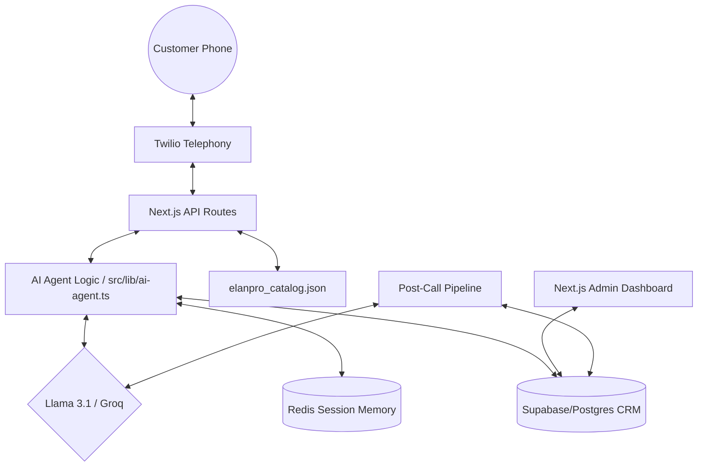
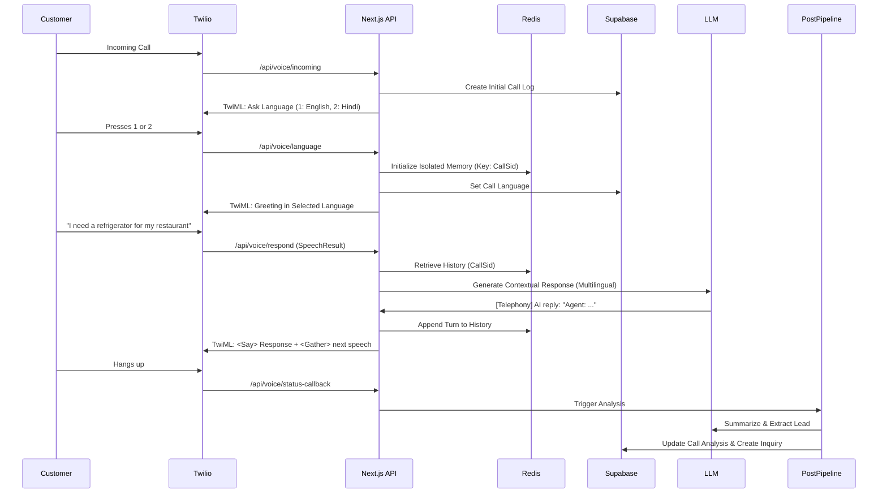

# AI Project Context: Elanpro AI Voice Agent & CRM

This document serves as a comprehensive, standalone reference for AI-driven analysis of the Elanpro AI Agent project. It details the architecture, codebase, data flow, and business logic to enable seamless integration and understanding by AI IDEs and development environments.

---

## **1. Project Mission & Identity**
- **Company:** Elan Professional Appliances Pvt. Ltd. (Elanpro).
- **Core Product:** India's No.1 Commercial Refrigeration Voice Agent.
- **Domain:** B2B Commercial Refrigeration (Chillers, Freezers, Display Cabinets).
- **Core Goal:** Transition from a demo e-commerce system to a production-ready "Elanpro" domain, automating customer inquiries (Sales, Order Status, Service) using a scalable, multilingual AI voice assistant integrated with a custom CRM.

---

## **2. Technical Stack**
### **Core Infrastructure**
- **Framework:** Next.js 16 (App Router, TypeScript)
- **Database:** Supabase (PostgreSQL) - Persistent storage for CRM, call logs, and analysis.
- **Session Memory:** Redis (ioredis) - Distributed, atomic session storage for high concurrency.
- **Telephony:** Twilio (Voice Webhooks, TwiML, Recording).

### **AI & Intelligence**
- **LLM Engine:** Llama 3.1 (via Groq Cloud for speed, fallback to local Ollama).
- **Transcription:** Twilio Speech-to-Text & OpenAI Whisper (via Cloud API) for post-call accuracy.
- **Logic:** Custom RAG-lite using `elanpro_catalog.json`.

### **Frontend & UI**
- **Styling:** Tailwind CSS 4.
- **Components:** Lucide React, Recharts (for dashboard analytics).
- **State Management:** Zustand (for dashboard state).

---

## **3. System Architecture (Graphify)**

### **A. Component Relationships**

### **B. Call Lifecycle Data Flow**

---

## **4. Codebase Structure & Module Map**

### **Core Modules (`src/lib/`)**
- **`ai-agent.ts`**: The central logic for AI interaction. Handles prompt building, LLM calls (Groq/Ollama), and structured response formatting.
- **`redis.ts`**: Manages distributed session memory with a critical local fallback mechanism. Ensures session isolation using `CallSid`.
- **`post-call-pipeline.ts`**: Processes call data after completion. Normalizes statuses, generates summaries, and updates CRM.
- **`lead-router.ts`**: Implements business logic for assigning inquiries to regional distributors.
- **`store.ts`**: Client-side state management for the dashboard.

### **API Routes (`src/app/api/voice/`)**
- `/incoming`: Initial entry point for Twilio.
- `/language`: Handles DTMF input and initializes session state.
- `/respond`: The "loop" that handles speech-to-speech interaction.
- `/status-callback`: Triggers cleanup and post-call processing.
- `/recording`: Downloads and processes call audio for higher accuracy.

---

## **5. Key Business Logic & Implementation Details**

### **A. Session Isolation & Scalability**
- **Mechanism:** Every call is uniquely identified by Twilio's `CallSid`. This ID is used as the key in Redis to store `history` and `state`.
- **Isolation:** Logic in `redis.ts` ensures no two calls can ever access each other's memory, even under high concurrency.
- **Graceful Fallback:** `isRedisAvailable` flag allows the system to switch to `localMemory` (Map) if the Redis connection fails, ensuring zero downtime in dev environments.

### **B. Multilingual Intelligence**
- **Language Detection:** User selects language via DTMF. The selection is stored in both Supabase and Redis.
- **Response Enforcement:** The LLM is strictly instructed to respond in the native script of the selected language (e.g., Hindi text in Devanagari).
- **Phonetic Correction:** The AI uses the `CallSid` state to correct phonetic errors in transcription (e.g., "human" -> "Hemanth") during entity extraction.

### **C. Product Knowledge (RAG-lite)**
- **Catalog:** `elanpro_catalog.json` contains detailed specs for 20+ commercial refrigeration products.
- **Knowledge Injection:** Product details are injected into the AI prompt based on customer interest, enabling accurate technical advice without a complex vector DB.

### **D. Supervisor Escalation Protocol**
- **Ask-Confirm-Escalate:** The agent only escalates to a human supervisor if:
    1. The issue is beyond automated resolution.
    2. The agent explicitly asks: "Would you like to speak to a supervisor?".
    3. The customer confirms with a positive response.

---

## **6. Database Schema (Supabase)**
| Table | Description | Key Columns |
| :--- | :--- | :--- |
| `users` | Admin/Distributor accounts | `email`, `role`, `is_active` |
| `distributors` | Regional partners | `name`, `state`, `phone`, `total_leads` |
| `inquiries` | Sales leads from calls/web | `status`, `priority`, `product_interest` |
| `call_logs` | Primary telephony records | `call_sid`, `caller_phone`, `status`, `transcript` |
| `call_analysis` | AI-extracted insights | `summary`, `sentiment`, `next_steps` |
| `products` | Technical appliance catalog | `model`, `capacity_ltr`, `temp_range` |

---

## **7. Configuration & Environment Variables**
- `TWILIO_ACCOUNT_SID`: Twilio account ID.
- `TWILIO_AUTH_TOKEN`: Twilio secret token.
- `GROQ_API_KEY`: API key for Llama 3.1 inference.
- `SUPABASE_URL` / `SUPABASE_SERVICE_ROLE_KEY`: Database access.
- `REDIS_URL`: Connection string for Redis (e.g., `redis://localhost:6379`).
- `NEXT_PUBLIC_APP_URL`: The public Ngrok or Vercel URL for webhooks.

---

## **8. Development & Workflow**
- **Testing:** Use `docs/test_call_scripts.md` for manual validation of Sales, Service, and Escalation flows.
- **Logs:** Real-time telephony logs are visible in the terminal via `[Telephony]` prefixes.
- **Migrations:** SQL scripts in `database/` handle schema updates and data cleaning.

---

## **9. AI-Aware "Graphify" Reference**
For AI IDEs analyzing this codebase:
1.  **Entry Point:** Start with `src/app/api/voice/incoming/route.ts`.
2.  **State Management:** Trace `CallSid` through `src/lib/redis.ts`.
3.  **Prompt Engineering:** Review the multi-stage prompts in `src/lib/ai-agent.ts`.
4.  **Data Integrity:** Check `database/fix_missing_columns_robust.sql` for current schema constraints.
