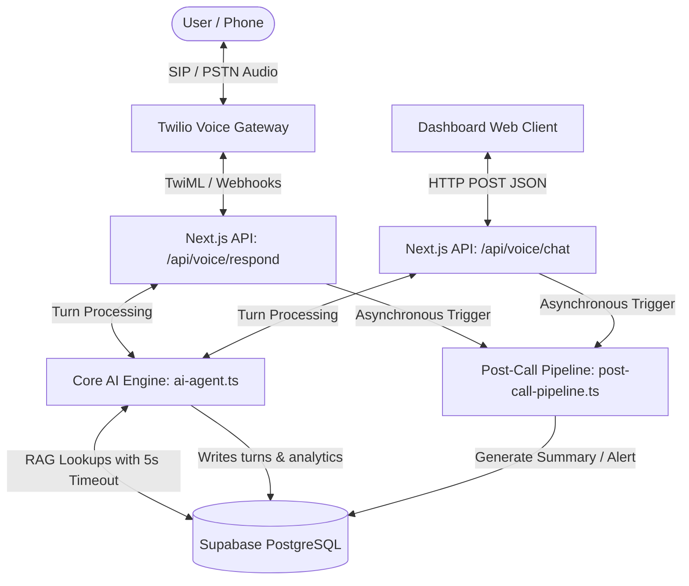

# Technical Architecture & System Overview: AI Support Agent (V2)

This document provides a comprehensive technical breakdown of the ShopEasy AI Support Agent system. It outlines the end-to-end data pipeline, RAG execution, state management, telephony hooks, and LLM orchestration.

---

## 1. System Architecture & Component Mapping



### Component Details
1. **Telephony Layer (Twilio)**: Handles voice calls, programmatically starts recording call audio, and gathers user speech via `<Gather input="speech">`.
2. **Dashboard / Web Client**: A Next.js `use client` interface running Zustand store states to support audio mic recording, live Web Speech API transcriptions, and direct REST API calls.
3. **Core AI Engine (`ai-agent.ts`)**: The state machine orchestrating conversation flows, topic switching, entity extraction, sentiment analysis, and database lookup triggers.
4. **Post-Call Pipeline (`post-call-pipeline.ts`)**: An asynchronous workflow executed when a call finishes. It cleans transcripts, classifies issue categories, generates brief summaries, and updates notifications.
5. **Database (Supabase PostgreSQL)**: Serves as the persistence layer for structured data, call logs, turn histories, notifications, and support tickets.

---

## 2. Conversation Pipeline & Data Flow

When a user speaks or sends a chat message, the following pipeline executes:

### Step 1: Voice/Text Ingestion
- For Telephony: Twilio posts a webhook with `SpeechResult` to `/api/voice/respond`.
- For Web Chat: The browser posts user message text and current transcript history to `/api/voice/chat`.
- The route identifies the session and loads existing transcript history from the `call_logs` table.

### Step 2: Intent & Entity Extraction (RAG)
The message is evaluated against the current conversation stage:
* **Name Introduction**: The engine parses the user message to extract the customer's name (e.g. *"My name is Rajesh Sharma"*) and saves it to the state. It does *not* categorize name introductions as support issues.
* **Topic Classification**: The engine dynamically classifies the issue into one of: `ORDER_ISSUE`, `PAYMENT_ISSUE`, `ACCOUNT_ISSUE`, `PRODUCT_QUERY`, or `OTHER`.
* **Database Queries (RAG)**:
  - If `PRODUCT_QUERY`: Looks up product descriptions and inventory stock in the `products` table.
  - If `ORDER_ISSUE`: Checks if the user provided an Order ID. If yes, it fetches delivery status, item names, and open support tickets from the database.
  - If `PAYMENT_ISSUE` / `ACCOUNT_ISSUE`: Looks up customer details via email or Customer ID in the `customers` table.

### Step 3: Database Timeout & Timeout Recovery
All database queries are wrapped in a 5000ms promise race:
```typescript
const { data, error } = await withTimeout(query, 5000);
```
- **First Timeout**: If a query stalls past 5 seconds, the agent says: *"Sorry, I'm having trouble fetching your details. Give me just a moment."* and retries the lookup.
- **Second Timeout**: If it stalls a second time, the agent flags `db_timeout = true` in `call_analysis`, automatically generates a support ticket, escalates the call, and tells the user: *"Our system is taking longer than usual. I have created a ticket for you."*

### Step 4: Topic-Switching State Machine
If the agent is waiting for a specific piece of data (e.g., waiting for an email address during a refund lookup) and the user shifts topics (e.g., *"Actually, my order is wrong"*):
- The `detectTopicSwitch()` helper triggers.
- It discards the previous collected variables (e.g. invalid IDs).
- It resets the lookup failure strike count to `0`.
- It dynamically updates the state to `ORDER_ISSUE` and starts prompting for the new issue's details (e.g., asking for the Order ID).

### Step 5: Escalations & Real sequential Ticket IDs
If lookups fail twice (2-Strike Rule) or if the customer exhibits high frustration (matching keywords like *"useless"*, *"human agent"*, *"angry"*):
- The agent calls `generateTicketFromDB()`.
- It executes `SELECT nextval('support_ticket_seq')` to grab a sequential ID (starting at 3000).
- It performs a database `INSERT` into the `support_tickets` table registering the ticket as open, linkable to the customer/order, and flagged as `urgent_flag = true`.
- The call status is flagged as `ESCALATED` or `ENDED`, triggering the goodbye sequence and terminating the call.

---

## 3. Post-Call Processing Pipeline

When `respond/route.ts` or `chat/route.ts` registers a status of `ENDED` or `ESCALATED`, the HTTP connection returns the final XML/JSON response immediately to avoid blocking, and fires the post-call pipeline in the background:

1. **Transcript Compilation**: Fetches all logged conversation turns for the call ID from the `call_turns` table.
2. **LLM Summary & Classification**: Sends the turns to Groq (fallback to local Ollama Llama 3) to categorize the call into one of five categories (`ORDER`, `PAYMENT`, `PRODUCT`, `ACCOUNT`, `GENERAL`) and writes a 2-3 sentence summary.
3. **Database Insertion**:
   - Updates `call_analysis` with the category (`call_group`), `summary_note`, and timestamps.
   - Inserts a record into the `notifications` table (populating dashboard alerts).
   - Overwrites `call_logs.ai_summary` with the final LLM-generated summary.

---

## 4. Technology Stack Summary

* **Frontend**: Next.js App Router (React, Tailwind CSS, Lucide icons, Zustand state store).
* **API Endpoints**: Next.js App Router API handlers (`NextRequest`, `NextResponse`).
* **Telephony Gateway**: Twilio API (SIP trunk, TwiML recording hooks, Outbound Click-to-Call API).
* **Databases**: Supabase (PostgreSQL with sequences, RPC helper functions, and database indices).
* **LLM Engine**: Local Ollama (Llama 3, 8B parameters) with Groq Cloud SDK integration (`llama-3.1-8b-instant`) to provide production-level low latency and rate-limit retry logic.
